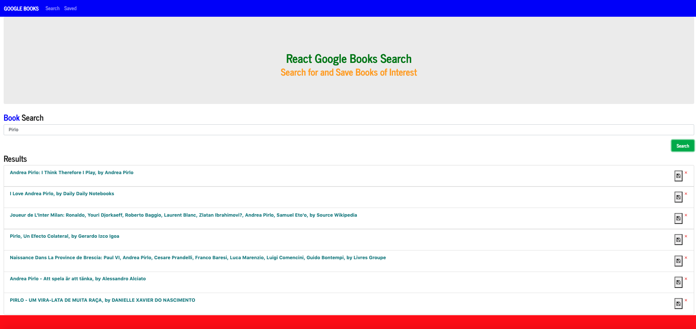

# Assignment 21: React Google Books Search

## Overview

In this assignment, I created a full-stack Google B◊ooks search app with React. The assignment required me to break up the application's UI into components, manage component state, and respond to user events.

## User Story

```
AS a user who is an avid reader, 
I WANT to be able to search for books to read, 
SO THAT I can expand my knowledge
```
- - -

## Acceptance Criteria

```
GIVEN I am a user who is an avid reader, 
WHEN I search for a book,
THEN I am presented with a list of books.

WHEN I click on the save button,
THEN I the book is added to my list of saved books.

WHEN I click on the "Saved" tab,
THEN I am presented with a list of saved books.

WHEN I click on a book,
THEN I am presented with the title, the author, an image, and a brief summary of the book.

WHEN I click on the "delete" button,
THEN I the book is deleted from the list.

```
- - -

## Features

The user is able to:

* Search for books

* Add them to a collection

* View a summary of a particular book

* Delete the book from a collection

## Usage and Installation

* After the GitHub repository has been cloned to your local device, run "npm install" in the terminal window inside the project's root directory

* Open MongoDB inside another terminal window by running either "mongo" or "mongod"

* Run the seed file by running "npm run seed" in the original terminal window

* Run npm start in the original terminal window and you will be redirected to http://localhost:3000/

## Application Screenshot



## Accesories and Technologies Used:
* HTML
* CSS
* [Bootstrap](https://getbootstrap.com/)
* [Font Awesome](https://fontawesome.com/)
* JSX
* React
* JSON
* Web Manifest
* Service Worker
* [Visual Studio Code](https://code.visualstudio.com/)
* [Google Chrome](http://www.google.com/chrome)
* [Node.js](https://nodejs.org/en/)
* Google Books API
* MongoDB
* Git/Terminal
* [GitHub](https://github.com/)
* Heroku


## Submission on BCS

* The URL to the deployed application: https://reactgoogle-booksearch.herokuapp.com/

* The URL to the Github repository: https://github.com/MG-cpu90/assignment21 
